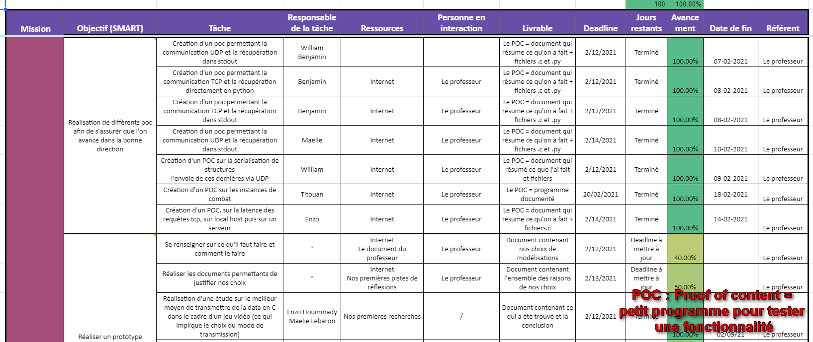
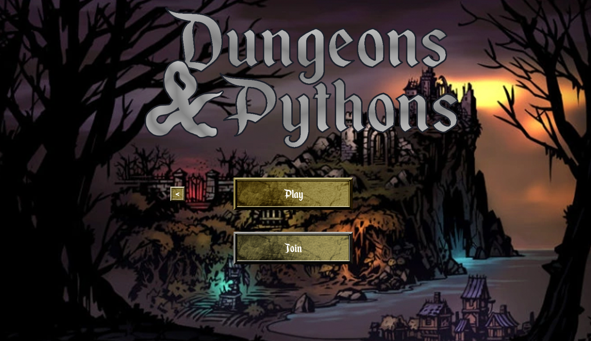

# Chronologie 

_Ce fichier a pour but de résumer la chronologie de notre projet, et comment nous avons avancé au fil des semaines. Vous pourrez y trouver des informations sur notre démarche et notre manière de fonctionner et des liens vers des fichiers justifiants nos démarches_ 

 

## Mise en place du projet et approche 

* **Mise en place du projet** :
    * Pour travailler, nous avons mis en place différents outils et plateformes afin de collaborer facilement :
        * Github pour le code et les petits programmes de tests
        * Un drive pour stocker les fichiers de réflexion, les comptes-rendus de nos réunions personnelles et les choses importantes
        * Un plan d'action, qui est un fichier EXCEL sous forme de tableau qui nous permet de nous organiser, de noter qui fait quoi et quand est-ce que la tâche sera finie 

     

    

     

* **Notre approche du projet** :
    * Pour travailler sur ce projet nous pensions que le plus simple était de travaiiler d'abord sur des programmes minimaux, réduit à une seule fonctionnalité, puis d'incrémenter sur ces programmes pour rajouter des fonctionnalités
    * Nous avons donc créé beaucoup de petits programmes qui se trouvent dans le dossier `poc/` pour tester diverses choses : les performances des protocoles, la sérialisation, une version très minimale d'un jeu auquel on peut connecter plusieurs joueurs, des méthodes pour faire transiter les données entre Python et C, etc.

  

## 1 Février - 7 Février 
    
* Création du repository sur Github et paramétrage de ce dernier 

* Petit programme pour envoyer des structures en C avec la sérialisation 
    * Plus d'informations sur le programme dans le dossier `poc/serialization`

* Petit programme pour lire sur la sortie standard ce que reçoit un serveur minimal UDP 
    * Plus d'informations sur le programme dans le dossier `poc/stdout-reading-udp`

* Petit jeu minimal, avec 2 joueurs qui peuvent se connecter (on peut faire bouger des carrés)
    * Plus d'informations sur le programme dans le dossier `poc/pygame-tcp`
    
## 8 Février - 14 Février 

* Améliorations du petit jeu pour avoir plus de 2 joueurs
    * Plus d'informations dans le dossier `poc/pygame-tcp-multi`

* Ajout d'une version du petit jeu avec le protocole UDP pour voir si ce dernier est plus rapide ou fonctionne mieux 
    * Plus d'informations dans le dossier `poc/pygame-udp-multi`

* Ajout d'une version du jeu avec des adresses IP automatiques 

* Ajout d'une version du petit jeu avec des threads 

## 15 Février - 21 Février 

* Création de la base du vrai jeu, en python : on a une fenêtre, des menus pour se connecter au jeu 
  
     

    

     

* Création d'un petit programme pour tester les instances de combat, pour réfléchir à l'adaptation de ces derniers 

## 22 Février - 28 Février 

* Détection et affichage de la latence en jeu dans la console, pour voir les performances du jeu 

## 1er Mars - 7 Mars 

* Ajout de la sérialisation dans les fichiers du jeu et définition des normes des structures que l'on va envoyer, afin d'avoir des paquets standardisés 

* Re-structuration de l'architecture du jeu pour que le tout soit propre et bien séparé en fonctionnalités 

## 8 Mars - 14 Mars 

* Ajout de la map (carte sur laquelle les joueurs se déplacent) dans le jeu, limité à une carte unique pour simplifier (c'est toujours sur la même carte que les joueurs vont jouer)

## 15 Mars - 21 Mars 

* Intégration totale de la sérialisation dans le jeu et travail sur l'ajout du personnage et des interfaces dans le jeu 

## 21 Mars - 15 Avril 

* Ajout d'un chat dans le jeu qui permet aux joueurs de communiquer entre eux 
* Améliorations des menus pour se connecter à d'autres jeu
* Travail sur l'ajout d'un personnage et de son pathfinding pour pouvoir commencer à ajouter des monstres

## 15 Avril - 15 Mai

* Ajout de l'inventaire du personnage, de coffres (seulement en local), et d'une fiche personnage pour voir l'état de son personnage à tout instant 
* Ajout des déplacements en réseaux du joueur

## 15 Mai - 10 Juin

* Ajout des coffres en réseaux, qui respectent la notion de propriété : on donne la propriété du coffre à qui veut l'ouvrir avant qu'il l'ouvre.
* Ajout des ennemis en réseaux
* Correction de la structure réseaux, qui utilisait un processus par connexion. Elle a été modifiée pour avoir seuelement deux processus, un côté "serveur" et un côté "client"