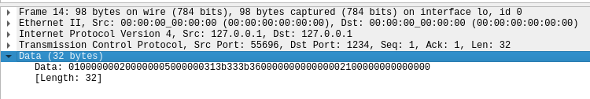

# __Sérialisation et envoi de structures en C__

   
## __Objectif__ 
* Découvrir comment on envoie des structures en C
* Découvrir ce qu’est la sérialisation des données 

<br>

## __Recherches__ 

### __Sources__
[Envoie de structure par socket, Openclassroom](https://openclassrooms.com/forum/sujet/envoi-de-structure-par-socket-83381)<br>
[Sérialiser une structure, StackOverflow (source principale)](https://stackoverflow.com/questions/15707933/how-to-serialize-a-struct-in-c)<br>
[Page Wikipédia de la sérialisation](https://fr.wikipedia.org/wiki/S%C3%A9rialisation#Codages_binaires)<br>
[Manuel de memcpy()](https://koor.fr/C/cstring/memcpy.wp)<br>

### __Notes__

* __*Le plus important*__:
   * La sérialisation est un processus **important** voire **quasi indispensable** pour **envoyer des structures sur le réseau**
   * Le processus est simple (sur le papier), il faut **créer une chaîne de caractères remplie par des bytes** et l'envoyer sur le réseau (en général, on utilise des ```unsigned char*``` pour nous débarrasser du bit qui donne le signe et pourrait perturber notre chaîne). Les bytes qui constituent notre chaîne proviennent des différents champs de la strucutre modulo ce que notre programme nécessite (on le verra plus tard mais j'ai opté pour des chaînes de caractères de longueur variable donc inconnu et je dois donc également inclure dans la chaîne de bytes la taille du champ ```char *``` de ma structure).
   * La sérialisation peut poser quelques **problèmes**: 
      * Les problèmes d'**endianness** c'est à dire que tous les processeurs n'ont pas le même fonctionnement et on doit absolument **conserver l'ordre des bytes** (consistance dans le *little-endian* ou le *big endian*) afin de pouvoir désérialiser sur n'importe quelle machine. Il y a certaines conventions que l'on peut trouver sur la page Wikipédia de la sérialisation.
      * Il faut faire attention à **ne pas envoyer de pointeurs** puisqu'un autre PC ne peut pas les utiliser, les variables ne sont pas définies pareil chez lui

<br>

## __Réalisation du POC__ :

C'est bien gentil tout ça, mais comment ça marche ce que j'ai fait ? C'est en soit assez simple, et c'est composé de **4 fichiers** dont je vais détailler le fonctionnement (compilables avec le Makefile du dossier)

### __Les fichiers de sérialisation__

On peut retrouver deux fichiers qui concernent la sérialisation : 

* ```serialization.h``` contient les **définitions des fonctions**, de la **structure ```game_packet```** ainsi que la documentation des fonctions :

   * La structure ```game_packet``` représente un *prototype*de ce que pourraient être les paquets dans le jeu c'est à dire : 
      * Un champ ```int player_id``` qui correspond au **joueur qui envoie le paquet**
      * Un champ ```int action``` qui correspond au **type d'action** (exemple : 3 pour ouvrir un coffre, 4 pour attaquer...)
      * Un champ ```char * data``` qui correspond aux **données de l'action effectuée**, et qui peut être de longueur à peu près ce qu'on veut (dans le poc j'ai mis "1;3;5" puisque d'après le prototype définit avec Titouan, on serait sur 1 pour le personnage du joueur qui fait l'action et les deux chiffres suivant sont des dépalcements x/y par exemple)

* ```serialization.c``` contient le code des fonctions que nous allons détailler ici :

   * *Remarque* : il est important de noter que ces fonctions servent *uniquement* à sérialiser ce type bien précis de paquet et que si on ajoute un champ dans la structure ou qu'on en supprime un la fonction doit être **refaite**

   * ```char * serialize(game_packet s_packet)```:

      * C'est cette fonction qui **réalise la sérialisation**, elle prend en entrée un paquet
      * Elle va d'abord chercher la **taille** cumulée de tous les champs de la structure + la taille du champ ```char* data``` (puisqu'elle n'est pas fixée) et elle va **créer une chaîne de caractère** qui contiendra les bytes
      * Avec la fonction ```memcpy()``` elle copie des **morceaux de mémoire** de la structure et les mets dans la chaine de caractère. (La fonction ```strcpy()``` est **t**rop lente** pour sérialiser parce qu'elle **scanne** la data qu'elle va copier et memcpy ne le fait pas)
      * Elle renvoie le paquet sérialisé 

   * ```char * deserialize(unsigned char* s_packet)```:
      * Cette fonction désérialise les données uniquement pour le paquet ```game_packet```
      * Elle récupère d'abord les **deux premiers attributs**, puis la **taille** de la chaîne de caractère pour **allouer** la taille nécessaire à la chaîne de caractère de la structure puis elle copie la chaîne
      * Elle renvoie la structure

### __Le client & le serveur TCP__

Je ne vais pas trop détailler parce que ce sont juste un client TCP & un serveur TCP très simple, et le client sérialise un paquet avant de l'envoyer puis le serveur désérialise et affiche les données du paquet à l'écran.


## __Lancer le POC ?__

* Compiler avec Makefile
* Lancer l'exécutable ```tcpserver```
* Lancer l'éxecutable ```tcpclient```


